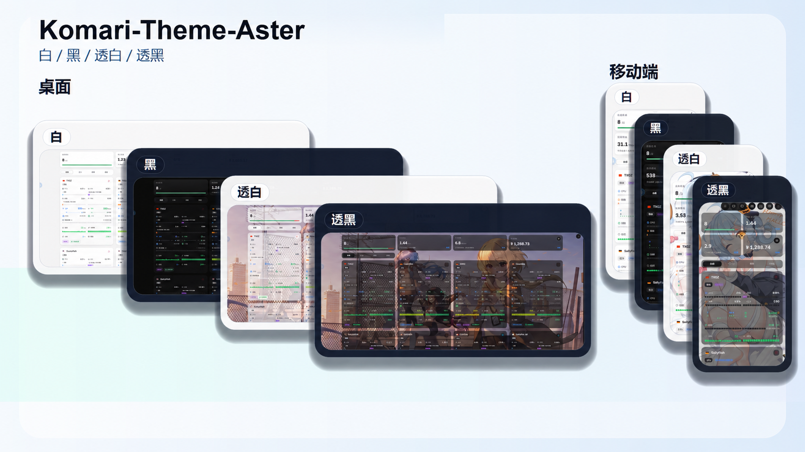

# Komari-Theme-LuminaPlus

### 由于项目更名 请大家**重新在komari添加一下新的主题仓库地址** 可能需要重新配置一下 带来不便请谅解，不好意思了铁铁们

基于 [komari-theme-Lumina](https://github.com/stqfdyr/komari-theme-Lumina) 的增强分支。感谢原作者 [stqfdyr](https://github.com/stqfdyr) 开源 Lumina 主题。

## 后端兼容性

主题会自动识别官方 Komari 与既有二次修改版的 RPC 能力，并将两者归一化为同一套页面数据模型。有关适配范围、迁移注意事项、指标与 Ping 的处理方式，以及完整的验证命令，请见 [兼容性说明](COMPATIBILITY.md)。

## 效果预览

  

### 首页总览与节点卡片

首页总览新增文字评级，节点卡片同步优化流量额度、在线时长与布局密度；支持背景图与卡片透明度调节。

  

  

  

  

### 透明背景

背景图与卡片透明度可在主题管理中配置，支持大卡片、小卡片和移动端布局。

  

  

  

  

### 实例详情

实例详情页优化 Ping 与负载图表展示，支持断点连线、手动刷新和更稳定的图表尺寸。

  

  

  

  

### 移动端

移动端总览卡片采用更紧凑的信息展示，保留评级和关键指标。

  

  

  

  

### 资产统计

资产统计界面重做，整合入口、指标、明细排序与汇率信息。

  

### 主题管理

主题管理新增总览评级配置，并加入小卡片在线时间、资产统计等显示项开关。

  

  

### 离线状态

离线节点保持清晰的状态提示，同时保留最近一次上报的关键指标。

  

## 致谢

特别感谢 [stqfdyr/komari-theme-Lumina](https://github.com/stqfdyr/komari-theme-Lumina)。

也感谢 Komari 官方主题、Mochi、PurCarte 等主题项目为 Komari 生态提供的设计和实现思路。

## 参考

- [Komari](https://github.com/komari-monitor/komari)
- [komari-theme-Lumina](https://github.com/stqfdyr/komari-theme-Lumina)
- [Komari 主题开发文档](https://komari-document.pages.dev/)

## Star History

<a href="https://www.star-history.com/?repos=shanyang242%2FKomari-Theme-LuminaPlus&type=timeline&legend=bottom-right">
 <picture>
   <source media="(prefers-color-scheme: dark)" srcset="https://api.star-history.com/chart?repos=shanyang242/Komari-Theme-LuminaPlus&type=timeline&theme=dark&legend=bottom-right" />
   <source media="(prefers-color-scheme: light)" srcset="https://api.star-history.com/chart?repos=shanyang242/Komari-Theme-LuminaPlus&type=timeline&legend=bottom-right" />
   
 </picture>
</a>
